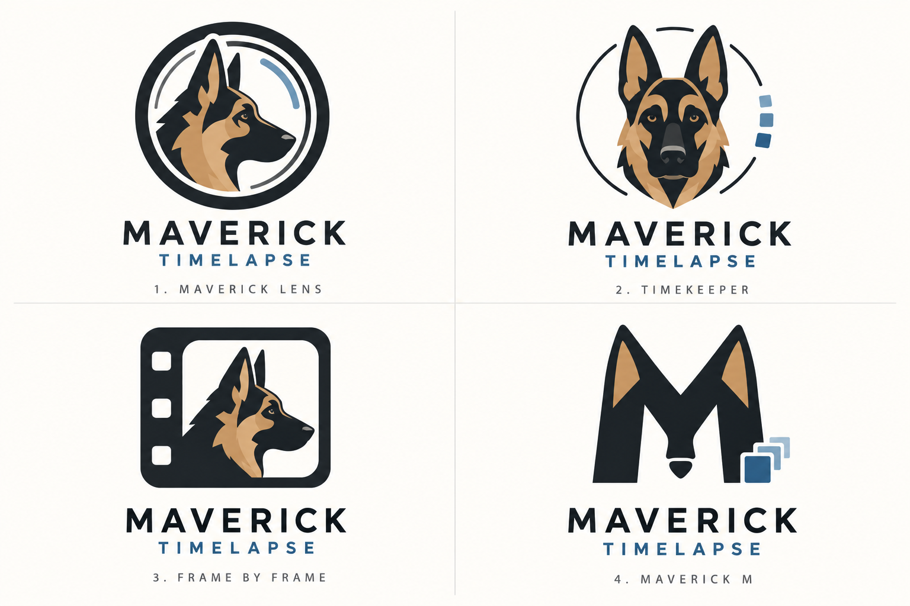

# Maverick Timelapse logo concepts

Four initial logo directions inspired by Maverick, a German Shepherd, and camera timelapses.

1. **Maverick Lens:** Shepherd portrait inside a camera lens.
2. **Timekeeper:** Shepherd with an orbit and sequential frame marks.
3. **Frame by Frame:** Shepherd inside a film frame.
4. **Maverick M:** ears and muzzle incorporated into an M, with stacked frames.

These are concept mockups for review; a final logo has not been selected.
